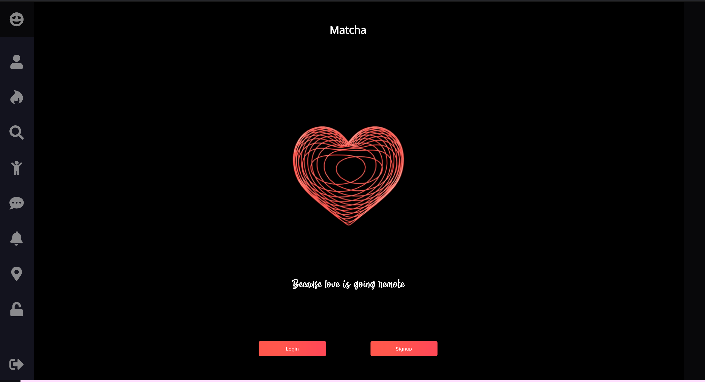
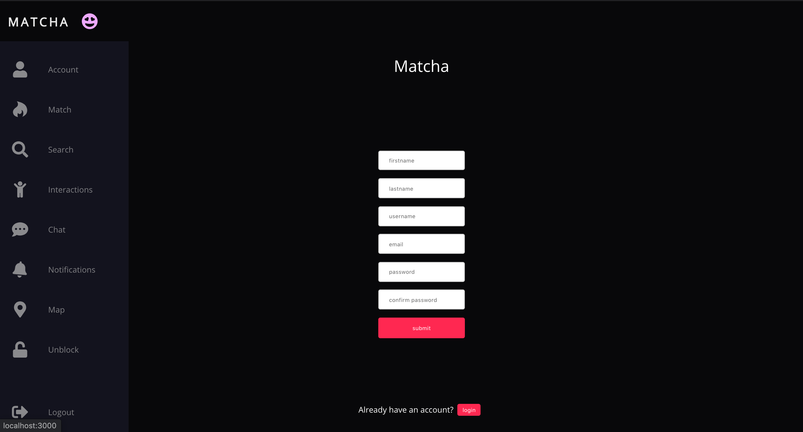
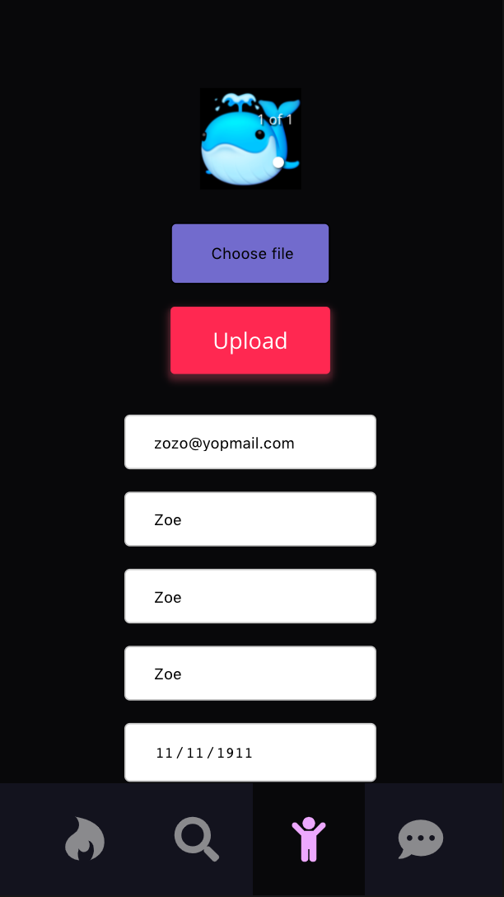
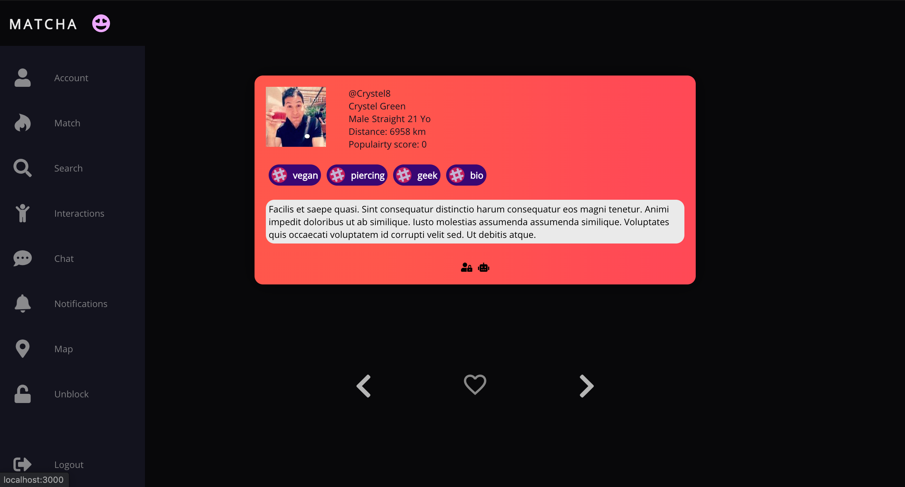
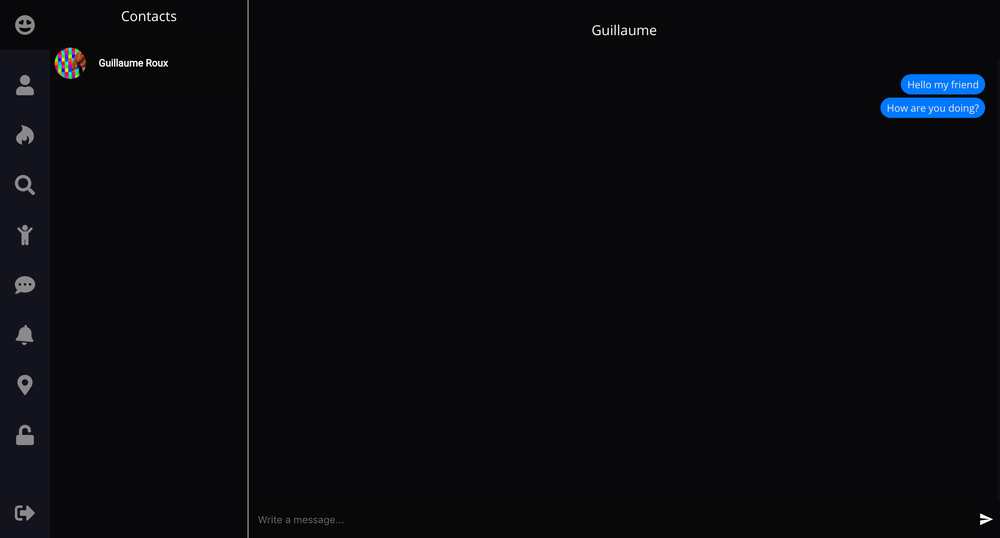
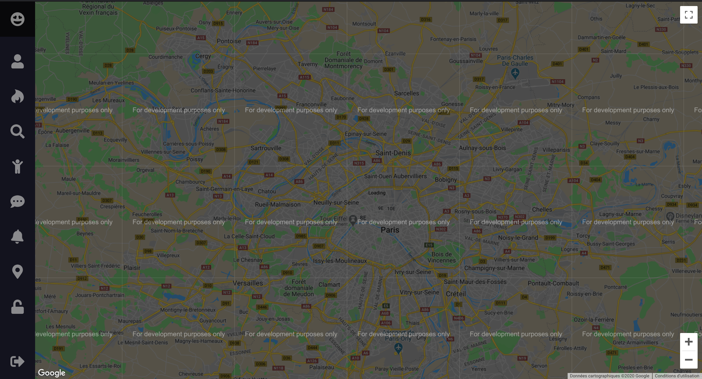

# Matcha

Matcha is the second project of the web branch at 42. The goal is to do a dating webapp, we are free to choose the languages / frameworks we want, but many tools are still forbidden (like object-relational mapping).

I was working with a friend on this project. We both wanted to learn something new so I went for React (as he already was comfortable with it) and he went for Neo4j, a graph oriented database.


## Starting the project

From your terminal run these commands

```
git clone https://github.com/sanstantua/matcha.git
cd matcha/front
yarn start
```

It should open a new tab in your browser with localhost/3000 in the url
If it does not open in your browser you can do it manually (it could be some other port if 3000 is already used)

## Front

I've work on all the frontend, except for the socket related stuff (chat and notifications).
As it was my first project with this technology, I did things in a way, then find another better way, then start again and so on...

React is a very powerful toolkit, yet I personally found it difficult.
You're never really sure what's happening under the hood so it's hard to know if your solution is elegant or trash.
I've used some of its hooks (mainly state, effect, context, custom).

The styling was also confusing at first, I used classic css files, then added material-ui and used their component and special styling methods.
In the end I've redesigned everything using basic css rules and style-components, removing material-ui.
I've learn that the simpler your design, the better.
The app is quite responsive.

Here are some screenshots of the app running:

### Homepage 

### Signup 

### Account (on mobile)

### Match

### Search

### Chat

### Unfinished map


## Back
